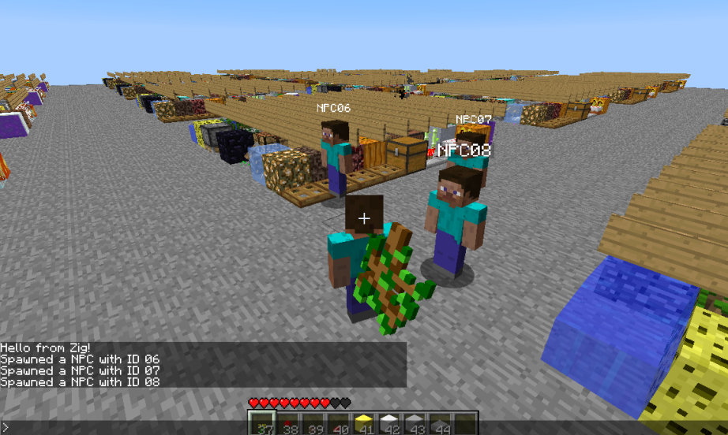

# Minestalgia

  
  

Minestalgia is a reimplementation of the Minecraft Beta 1.7.3 server software.
It's written in Zig and as of now doesn't depend on any third party libraries,
or even libc. It makes use of Linux's asynchronous I/O APIs for networking, and
for now runs entirely on a single thread. Recently I've started working on world
generation for Minestalgia, which has been going well. I have lore accurate
Random and Perlin Noise generators implemented in Zig.

The project is still in its infancy and under very active development.

# Discord Fetch (2024)

Discord Fetch is a smaller project of mine (~200 loc) that was made in a day,
but I've had a lot of people ask me about it so I decided to add it here.
Discord Fetch is a simple program that adds a customizable activity to your
Discord profile that displays information about your currently running Linux
distro, such as the version and uptime. That's all.

If you're on NixOS and are interested in using it, installation & setup
instructions are available on the GitHub.

[Git Repository](https://github.com/cody-quinn/discordfetch).

# Sloth (2023)

Sloth is a statically typed, procedural programming language I worked on with my
friend Nic Gaffney. The compiler is implemented using Rust, LLVM, and Inkwell.
The language isn't very capable, it's confusing, and the compiler is buggy, but
it does work and has some simple example programs written in it like Conway's
Game of Life and a Mandelbrot Plotter.

[Git Repository](https://github.com/slothlang/sloth).
