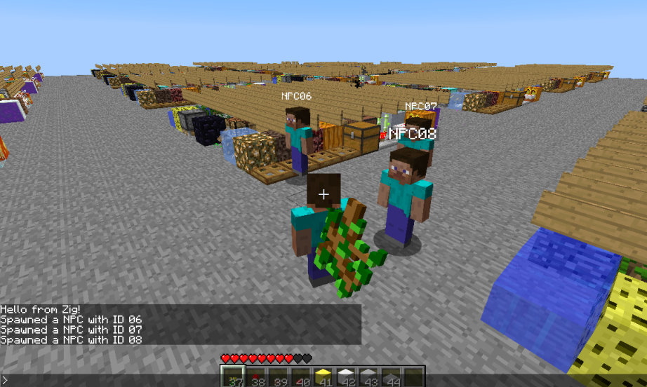
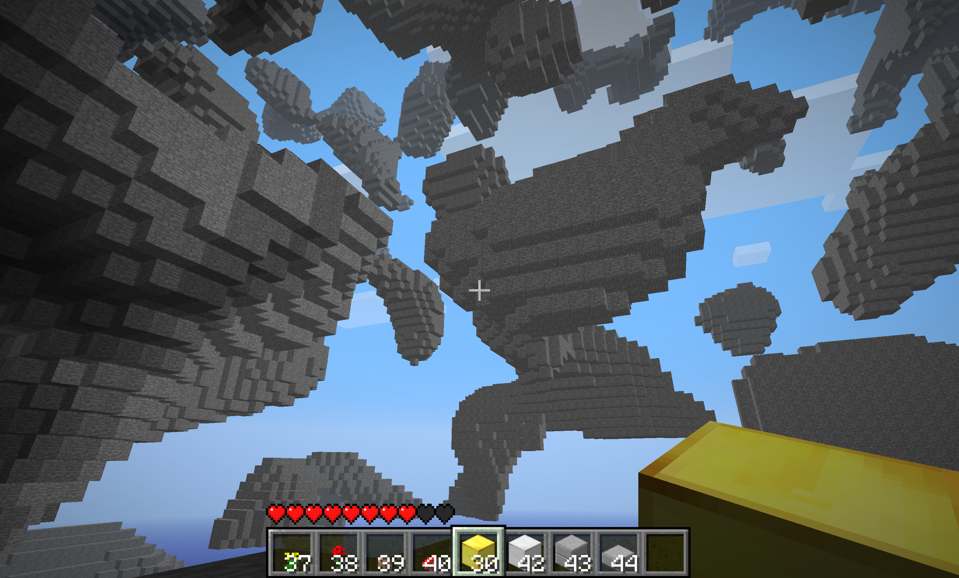

# Minestalgia

  
  

Minestalgia is a reimplementation of the Minecraft Beta 1.7.3 server software.
It's written in Zig and as of now doesn't depend on any third party libraries,
or even libc. It makes use of Linux's asynchronous I/O APIs for networking, and
for now runs entirely on a single thread. 

The project is still in its infancy and under very active development.

# Sloth (2023)

Sloth is a statically typed, procedural programming language I worked on with 
my friend Nic Gaffney. The compiler is implemented using Rust, LLVM, and 
Inkwell. The language isn't very capable, it's confusing, and the compiler is 
buggy, but it does work and has some simple example programs written in it like
Conway's Game of Life and a Mandelbrot Plotter.

[Git Repository](https://github.com/slothlang/sloth).
